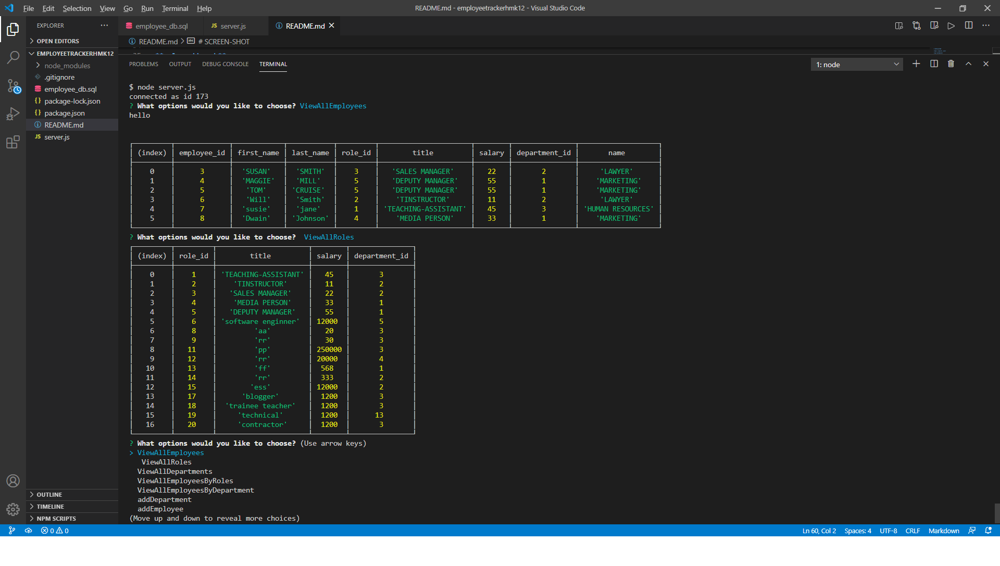
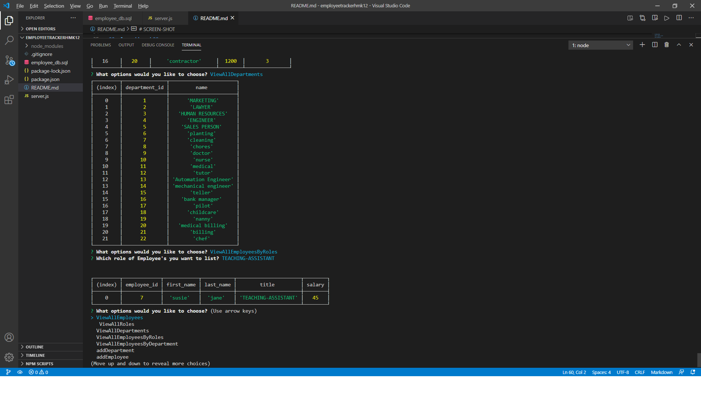
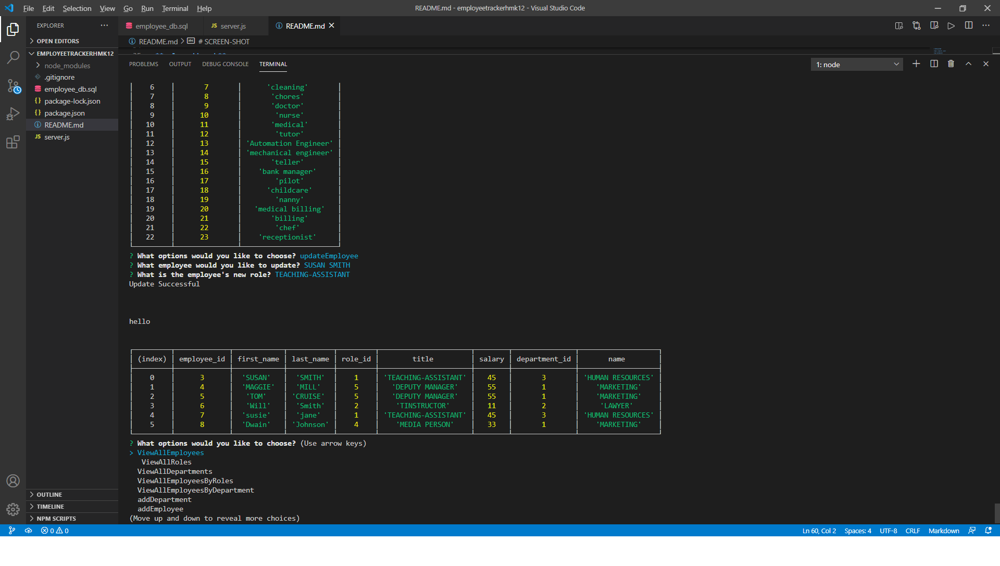

# ABOUT

In this application, managed the **DATA** of **EMPLOYEE** as 
**EMPLOYEE TRACKER**. User is prompted with **EMPLOYEE** related 
questions, and after answering the prompt questions certain required
**TABLE** is generated . And also, **created** **DATABASE** and **TABLES**
in **SQL WORKBENCH**.

# TABLE OF CONTENTS

[DETAILED-DESCRIPTION](#DETAILED-DESCRIPTION)

[INSTALLATION](#INSTALLATION)

[RESOURCES-REFERRED](#RESOURCES-REFERRED)

[VIDEO-DEMO](#VIDEO-DEMO)

[GIT-HUB-REPOSITORY](#GIT-HUB-REPOSITORY)

[SCREEN-SHOT](#SCREEN-SHOT)

# DETAILED-DESCRIPTION

**USER** will run **node server.js** on terminal,
will be presented with some choices  like **VIEWALLEMPLOYEE**,**ADDROLE** etc.
After, selecting one of the choices, user will be presented with the **EMPLOYEE TABLE** as per user's selection. One has to install **npm i , sql ** to get all 
the **DEPENDENCIES**. ALSO , need to create **EMPLOYEE-DB** in **SQL WORKBENCH**
HAVE to create employee,role,department tables in the **EMPLOYEE-DB**.
**CONNECTION** to the **DATABASE** in sql workbench is very important in **CODE** to move further in the working of this application. **WRITING QUERIES** to get recquired data from **EMPLOYEE-DB** in **CODE**. And it's very important to 
**END** the connection after testing the application on the terminal.

# INSTALLATION

**npm i inquirer, sql**

**sql workbench**

**Vs Code**

# **RESOURCES-REFERRED**

[SQL](https://sqlbolt.com/lesson/introduction)

[INQUIRER](https://www.npmjs.com/package/inquirer)

[STACK-OVERFLOW](https://stackoverflow.com/questions/5706437/whats-the-difference-between-inner-join-left-join-right-join-and-full-join/6188334)

# **VIDEO-DEMO**
[VIDEO-DEMO](https://drive.google.com/file/d/1VpRzkYZA1K5J7FgAv-FjrdB7UWkij6Hz/view)

# **GIT-HUB-REPOSITORY**

[GIT_HUB-REPOSITORY](https://github.com/nehreetkaur/employeetrackerhmk12)

# SCREEN-SHOT

